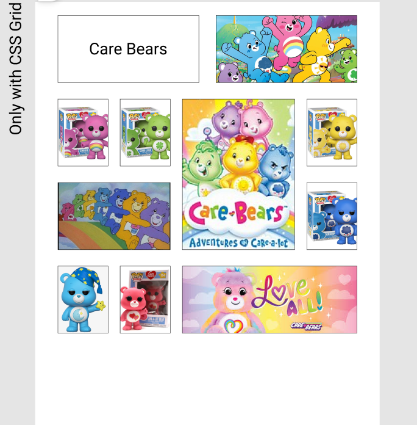

# CSS Grid Exercise - Care Bears by William Hernández

Este proyecto es un ejercicio práctico de maquetación web enfocado en el dominio de **CSS Grid Layout**, desarrollado para el módulo **FrontEnd: HTML5 & CSS3** en **JM Factoria 5**.

El objetivo principal es replicar con total fidelidad la estructura y el esquema de diseño base proporcionado en el archivo de Figma, aplicando estilos propios basados en la temática de Care Bears.

## 🚀 Demo en Github Pages

Puedes ver el resultado del proyecto desplegado aquí:
🔗 **[Ver en GitHub Pages](https://wfhgdev.github.io/BootCampWebF5-CSSGridExercise/)**

---

## 📋 Requisitos y Objetivos del Proyecto

* **Uso de CSS Grid:** Estructurar el diseño completo utilizando las propiedades nativas de CSS Grid de forma limpia y eficiente.
* **Fidelidad del Esquema:** Respetar estrictamente la distribución y proporciones del layout de referencia.
* **Temática:** Inspirada en el universo de *Care Bears*.
* **Despliegue:** Proyecto publicado de forma pública a través de GitHub Pages.

## 🛠️ Tecnologías Utilizadas

* **HTML5** - Para la estructura semántica del contenido.
* **CSS3 (Grid Layout)** - Para el diseño, posicionamiento y estilos visuales.
* **Figma** - Referencia de diseño e interfaz de usuario.

    

---

## 📁 Estructura de Archivos

```text
├── index.html          # Estructura HTML principal
├── index.css           # Hoja de estilos con la configuración de CSS Grid         
└── images/             # Recursos visuales (Imágenes de los Care Bears, iconos, etc.)